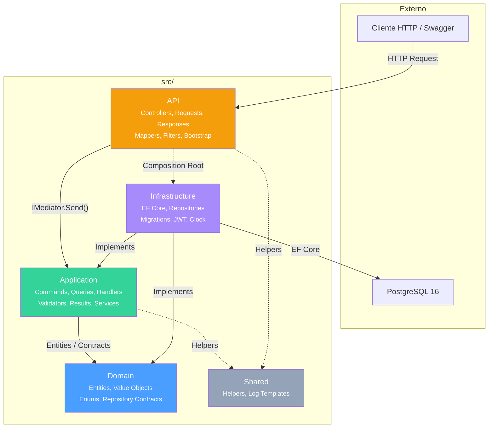
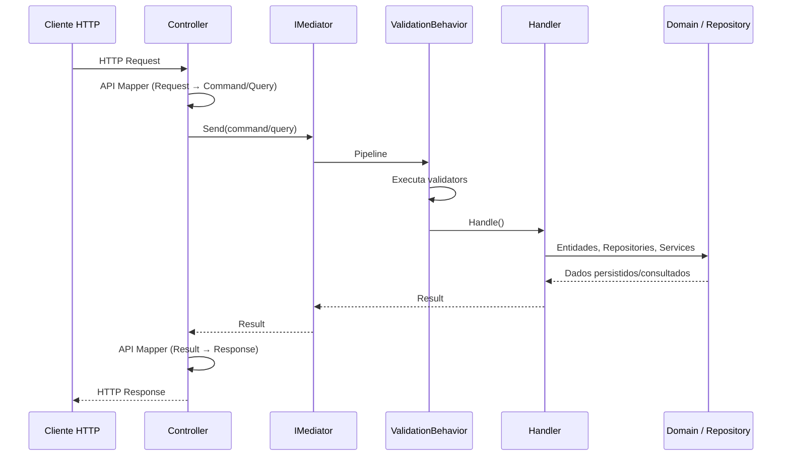
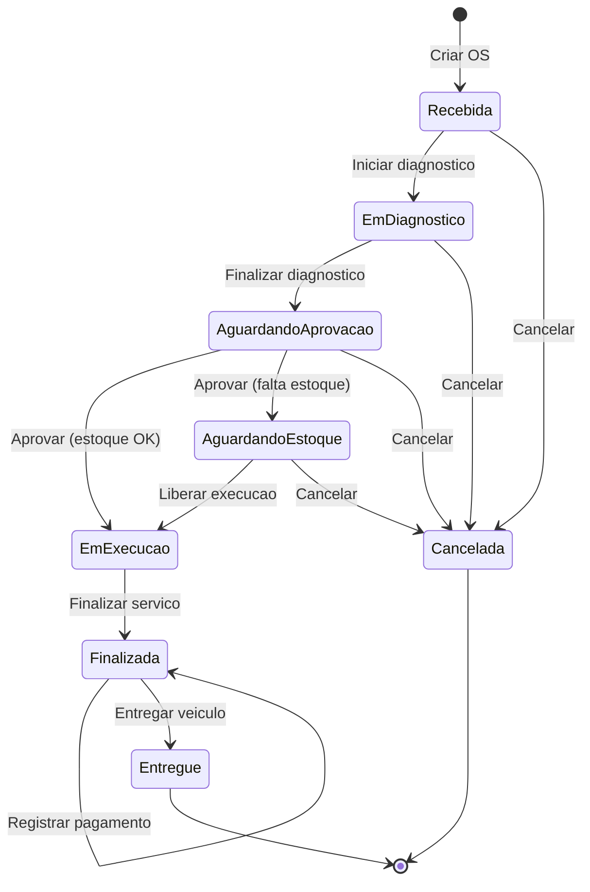
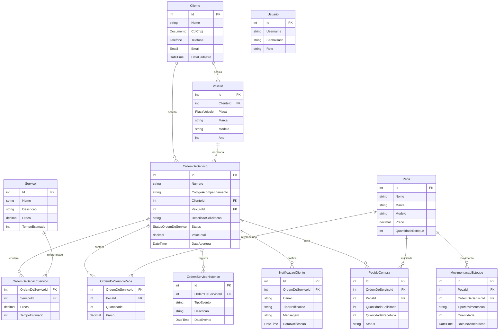

# Arquitetura

## Visao geral

A solucao e uma API REST em Clean Architecture, organizada por camadas e orientada a casos de uso. A camada `API` expoe contratos HTTP e delega a execucao para a `Application` via MediatR. A `Application` implementa CQRS separando Commands, Queries, Handlers, Validators e Results. A `Domain` concentra entidades, value objects, enums e contratos de repositorio. A `Infrastructure` implementa os detalhes tecnicos, como Entity Framework Core, PostgreSQL, JWT, clock e repositorios concretos.

O dominio principal e a ordem de servico, integrado a clientes, veiculos, servicos, pecas, estoque, notificacoes e pedidos de compra.

## Camadas

```text
API
  Contratos HTTP, controllers, filtros, autenticacao, validacao de requests,
  mappers de entrada/saida e composition root da aplicacao.

Application
  Casos de uso com CQRS + MediatR, validators de commands/queries,
  pipeline behaviors, results, DTOs, interfaces tecnicas e servicos de apoio.

Domain
  Entidades, value objects, enums, regras de negocio e contratos de repositorio.

Infrastructure
  DbContext, configuracoes EF Core, migrations, repositories, seed,
  health checks, JWT, clock e transacoes.

Shared
  Helpers e utilitarios compartilhados sem dependencia das camadas externas.
```

## Diagrama de camadas



## Dependencias entre projetos

```text
API
  -> Application
  -> Infrastructure

Infrastructure
  -> Application
  -> Domain

Application
  -> Domain

Domain
  -> sem dependencia de API, Application ou Infrastructure
```

A API referencia Infrastructure apenas no composition root para registrar implementacoes concretas. Controllers nao acessam `DbContext`, repositories concretos ou servicos de infraestrutura diretamente.

## Estrutura principal

```text
src/
  API/
    Bootstrap/
    Controllers/
    Filters/
    Mappers/
    ProblemDetails/
    Requests/
    Responses/
    Services/
    Validators/

  Application/
    Behaviors/
    Commands/
    Common/
    DTOs/
    Exceptions/
    Handlers/
    Interfaces/
    Mappers/
    Options/
    Queries/
    Results/
    Security/
    Services/
    Validators/

  Domain/
    Entities/
    Enums/
    Repositories/
    ValueObjects/

  Infrastructure/
    Data/
      Configurations/
      Seeders/
    Extensions/
    HealthChecks/
    Logging/
    Migrations/
    Repositories/
    Security/
    Time/

  Shared/
    Helpers/
    Logging/
```

## Papel de cada pasta

### `src/API`

- `Bootstrap`: extensoes de inicializacao da API, como servicos, pipeline HTTP, Swagger, JWT, logging e banco.
- `Controllers`: endpoints REST. Cada controller recebe `IMediator`, monta Commands/Queries e retorna Responses HTTP.
- `Filters`: filtros globais. `DomainExceptionFilter` converte excecoes conhecidas em respostas padronizadas.
- `Mappers`: conversoes entre `Request -> Command/Query` e `Result -> Response`.
- `ProblemDetails`: modelo padronizado para erros HTTP.
- `Requests`: contratos de entrada da API. Representam payloads e parametros HTTP, nao regras de negocio.
- `Responses`: contratos de saida da API. Representam a forma publica retornada ao consumidor.
- `Services`: implementacoes acopladas ao ASP.NET Core, como usuario autenticado via `HttpContext`.
- `Validators`: validadores de requests HTTP usados pela integracao do FluentValidation com ASP.NET Core.

### `src/Application`

- `Behaviors`: pipelines do MediatR. Hoje `ValidationBehavior<TRequest,TResponse>` executa validadores antes do handler.
- `Commands`: intencoes de escrita, como criar, atualizar, deletar, aprovar, liberar ou finalizar.
- `Common`: abstracoes comuns da aplicacao, como `IClock`.
- `DTOs`: modelos internos usados em casos de uso mais compostos.
- `Exceptions`: excecoes previsiveis da aplicacao, convertidas pela API em respostas HTTP.
- `Handlers`: implementacao dos casos de uso. Cada handler implementa `IRequestHandler<TRequest,TResponse>`.
- `Interfaces`: contratos tecnicos consumidos pela aplicacao, como `ITransactionManager`.
- `Mappers`: conversoes entre entidades de dominio, DTOs e Results.
- `Options`: opcoes de configuracao consumidas pela aplicacao, como JWT.
- `Queries`: intencoes de leitura. Nao devem alterar estado.
- `Results`: modelos de retorno dos casos de uso. Nao sao contratos HTTP.
- `Security`: abstracoes e resultados relacionados a autenticacao/autorizacao.
- `Services`: servicos de apoio da aplicacao para regras que coordenam mais de uma operacao, especialmente em ordens de servico.
- `Validators`: validadores de Commands e Queries, executados pelo `ValidationBehavior`.

### `src/Domain`

- `Entities`: entidades e agregados com comportamento de negocio.
- `Enums`: estados e classificacoes do dominio.
- `Repositories`: contratos de persistencia usados pelos handlers e implementados pela Infrastructure.
- `ValueObjects`: objetos de valor como `Documento`, `Telefone` e `PlacaVeiculo`.

### `src/Infrastructure`

- `Data`: `OficinaDbContext`, configuracoes EF Core e seeders.
- `Data/Configurations`: mapeamentos por entidade com `IEntityTypeConfiguration<T>`.
- `Extensions`: extensoes de host, incluindo migracao e seed no startup.
- `HealthChecks`: configuracoes de health checks.
- `Logging`: formatacao de log de console.
- `Migrations`: migrations do Entity Framework Core.
- `Repositories`: implementacoes concretas dos contratos de `Domain.Repositories`.
- `Security`: implementacao tecnica de geracao de token JWT.
- `Time`: implementacao concreta de relogio da aplicacao.

### `src/Shared`

- `Helpers`: funcoes utilitarias para documentos, telefone, placa, strings e datas.
- `Logging`: templates padronizados de log compartilhados.

## Clean Architecture aplicada

A regra principal e manter dependencias apontando para dentro:

```text
HTTP / ASP.NET Core / EF Core / PostgreSQL / JWT
        -> API e Infrastructure
        -> Application
        -> Domain
```

Na pratica:

- controllers conhecem `IMediator`, requests, responses e mappers da API;
- controllers nao conhecem handlers concretos, repositories ou `DbContext`;
- handlers conhecem Commands/Queries, Results, entidades, value objects e contratos de repositorio;
- handlers nao conhecem controllers, requests HTTP ou responses HTTP;
- entidades de dominio nao conhecem MediatR, EF Core, ASP.NET Core ou PostgreSQL;
- Infrastructure conhece os contratos internos para fornecer implementacoes concretas.

## CQRS com MediatR

CQRS significa separar comandos de escrita de consultas de leitura:

- `Commands`: requests que alteram estado. Ex.: `CriarClienteCommand`, `AtualizarPecaCommand`, `LiberarExecucaoCommand`.
- `Queries`: requests que apenas consultam dados. Ex.: `ListarClientesQuery`, `ObterOrdemDeServicoPorIdQuery`, `ObterAcompanhamentoOSQuery`.

MediatR e o mediador entre a API e os casos de uso:

```text
Controller -> IMediator.Send(command/query) -> Handler
```

Cada Command ou Query implementa `IRequest<TResponse>`. Cada Handler implementa `IRequestHandler<TRequest,TResponse>`.

Exemplo real simplificado:

```text
CriarClienteCommand : IRequest<ClienteResult>
CriarClienteCommandHandler : IRequestHandler<CriarClienteCommand, ClienteResult>
```

Para operacoes sem corpo de retorno, o projeto usa `Unit`, por exemplo `DeletarClienteCommand : IRequest<Unit>`.

## Fluxo Request -> Command/Query -> Handler -> Result -> Response

O fluxo padrao implementado e:



Exemplo com criacao de cliente:

```text
POST /api/v1/clientes
  -> CriarClienteRequest
  -> ClienteApiMapper.ToCommand()
  -> CriarClienteCommand
  -> IMediator.Send(command)
  -> CriarClienteCommandValidator
  -> CriarClienteCommandHandler
  -> Cliente.Criar(...)
  -> IClienteRepository.CriarAsync(...)
  -> ClienteResult
  -> ClienteApiMapper.ToResponse()
  -> 201 Created + ClienteResponse
```

Papel de cada objeto:

- `Request`: contrato HTTP de entrada da API. Deve refletir o payload externo.
- `Command`: intencao de alterar estado. Pertence a Application e representa um caso de uso de escrita.
- `Query`: intencao de consulta. Pertence a Application e nao deve alterar estado.
- `Handler`: executa o caso de uso, aplica regras, chama dominio, repositories e servicos de apoio.
- `Result`: retorno interno da Application. Nao deve depender de ASP.NET Core.
- `Response`: contrato HTTP de saida da API. Deve ser estavel para consumidores externos.

## Validacao

Existem dois pontos de validacao:

```text
API Validators
  -> validam Requests HTTP antes ou durante o model binding.

Application Validators
  -> validam Commands e Queries pelo ValidationBehavior do MediatR.
```

Regras de formato e obrigatoriedade ficam nos validators. Regras de negocio e invariantes ficam nas entidades, value objects e handlers.

## Composition root

`Program.cs` esta enxuto e delega o registro por camada:

```csharp
builder.Services.AddApiServices(builder.Configuration);
builder.Services.AddApplication();
builder.Services.AddInfrastructure(builder.Configuration, builder.Environment);
```

- `AddApiServices`: controllers, filtros, ProblemDetails, validators de requests, JWT, Swagger, CORS e usuario autenticado.
- `AddApplication`: MediatR, `ValidationBehavior`, validators de Application e servicos de apoio.
- `AddInfrastructure`: DbContext, PostgreSQL/InMemory, health checks, repositories, transacao, clock e JWT.

## Dominio de ordem de servico

`OrdemDeServico` e o agregado central. Ele concentra fluxo de status, composicao de orcamento, validacoes operacionais e bloqueio por falta de estoque.

### Maquina de estados da OS



### Regras de composicao do orcamento

- servicos so podem ser adicionados ou removidos em `EmDiagnostico`;
- pecas podem ser adicionadas em `EmDiagnostico`, `AguardandoAprovacao` e `AguardandoEstoque`;
- pecas so podem ser removidas em `EmDiagnostico`;
- a transicao para `EmExecucao` depende de validacao de estoque com sucesso;
- se faltar estoque, a OS vai para `AguardandoEstoque` e pode gerar pedido de compra.

## Modelo de entidades



## Persistencia

Banco principal:

- PostgreSQL 16

Banco para testes:

- EF Core InMemory quando `Environment=Testing` ou connection string `UseInMemory`.

Migrations:

- mantidas em `src/Infrastructure/Migrations`;
- aplicadas automaticamente no startup fora do ambiente de testes.

O PostgreSQL foi escolhido por ser relacional, transacional e adequado ao dominio, que possui relacionamentos fortes entre clientes, veiculos, ordens de servico, servicos, pecas, movimentacoes de estoque, notificacoes e pedidos de compra. O controle transacional e importante para operacoes que envolvem validacao de estoque, mudanca de status, historico e criacao de pedidos de compra.

## Seguranca

Autenticacao:

- JWT Bearer;
- login implementado por `LoginCommand` e `LoginCommandHandler`;
- geracao concreta do token em `JwtTokenGenerator`, na Infrastructure.

Estado atual da autorizacao:

- protegidos: `Clientes`, `Veiculos`, `Servicos`, `Pecas`, `OrdensDeServico`, `PedidosCompra`;
- publicos: `Auth`; os endpoints de acompanhamento e resposta da OS sao acessados pelo cliente autenticado com JWT.

## Observabilidade

Health checks expostos:

- `/health`
- `/health/live`
- `/health/ready`

Logging:

- console logging;
- templates padronizados em `Shared/Logging`;
- logs em handlers e startup.

## Testabilidade

O projeto possui:

- testes unitarios focados em handlers, behaviors e registros de dependency injection;
- testes de integracao focados em controllers/endpoints;
- suporte a banco em memoria para cenarios de teste.
