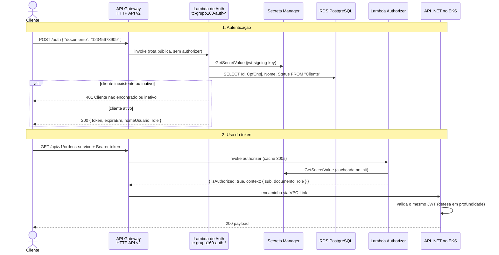

# RFC-0002: Estratégia de autenticação por CPF e escolha do API Gateway

| | |
|---|---|
| **Status** | Rascunho |
| **Autor** | Grupo 160 |
| **Data** | 2026-08-26 |
| **Issue** | [#35](https://github.com/tech-challenge-grupo-160/tech-challenge-oficina-mecanica/issues/35) |
| **Prazo para comentários** | 2026-08-29 |

## Resumo

Propõe-se adotar o **Amazon API Gateway HTTP API (v2)** como porta de entrada da aplicação, com a autenticação por CPF resolvida pela **Lambda de autenticação** já implementada e a proteção das rotas feita por um **Lambda authorizer** — não pelo authorizer JWT nativo.

Esta é a parte que exige atenção do grupo: a [RFC-0001](0001-escolha-da-nuvem.md) registrou a intenção de usar *"API Gateway (REST API, com JWT authorizer)"*. **Essa combinação não existe.** O authorizer JWT nativo é exclusivo do HTTP API (v2), e mesmo lá ele não valida o token que nossa Lambda emite hoje: exige um emissor OIDC com JWKS público e assinatura assimétrica, enquanto o [`JwtTokenGenerator`](https://github.com/tech-challenge-grupo-160/tech-challenge-lambda-auth/blob/develop/Fiap.TechChallenge.OficinaMecanica.AuthLambda/Application/Security/JwtTokenGenerator.cs) assina com HMAC-SHA256 e segredo compartilhado.

A proposta é manter a assinatura simétrica e trocar o mecanismo de authorizer, não o contrário. O custo é uma função pequena e isolada; a alternativa — migrar para RS256 e hospedar um endpoint JWKS — mexeria na Lambda, na API .NET e adicionaria um componente novo à infraestrutura, a 19 dias da entrega.

## Motivação

A Fase 3 exige que o acesso à API passe por um API Gateway e que a identificação do cliente aconteça por CPF em uma função serverless. A Lambda que faz isso **já está pronta e testada** ([#38](https://github.com/tech-challenge-grupo-160/tech-challenge-oficina-mecanica/issues/38), [#39](https://github.com/tech-challenge-grupo-160/tech-challenge-oficina-mecanica/issues/39), [#40](https://github.com/tech-challenge-grupo-160/tech-challenge-oficina-mecanica/issues/40), [#41](https://github.com/tech-challenge-grupo-160/tech-challenge-oficina-mecanica/issues/41)), mas não está exposta: não há gateway, não há proteção de rotas e o segredo de assinatura ainda mora em código.

Sem esta decisão registrada, o Terraform do gateway não pode ser escrito. Cinco issues do épico E1 dependem dela — [#42](https://github.com/tech-challenge-grupo-160/tech-challenge-oficina-mecanica/issues/42), [#43](https://github.com/tech-challenge-grupo-160/tech-challenge-oficina-mecanica/issues/43), [#44](https://github.com/tech-challenge-grupo-160/tech-challenge-oficina-mecanica/issues/44), [#45](https://github.com/tech-challenge-grupo-160/tech-challenge-oficina-mecanica/issues/45) e [#46](https://github.com/tech-challenge-grupo-160/tech-challenge-oficina-mecanica/issues/46) — e o épico não fecha sem elas.

Se não fizermos nada, o risco concreto é escrever o Terraform do authorizer nativo, descobrir no `apply` que ele não valida nosso token, e perder dias do caminho crítico refazendo o desenho.

## Proposta

### Fluxo ponta a ponta



O CPF é validado localmente pelo value object [`Documento`](https://github.com/tech-challenge-grupo-160/tech-challenge-lambda-auth/blob/develop/Fiap.TechChallenge.OficinaMecanica.AuthLambda/Domain/ValueObjects/Documento.cs) — formato e dígitos verificadores — antes de qualquer consulta ao banco. Documento malformado nunca chega ao RDS.

### Por que a API .NET continua validando o token

O gateway já barra o token inválido, então validar de novo na API é redundante — de propósito. São três motivos:

1. A API roda no EKS e, durante o desenvolvimento, é acessada direto por `port-forward` e pelo Swagger, sem passar pelo gateway.
2. Se o VPC Link for mal configurado e o serviço ficar alcançável por outro caminho, a autenticação não cai junto.
3. O código já faz isso e funciona. Remover teria custo e nenhum ganho.

### Formato e claims do JWT

Contrato já implementado, registrado aqui para virar contrato formal entre os três componentes:

| Campo | Valor | Origem |
|---|---|---|
| `alg` | `HS256` | `SecurityAlgorithms.HmacSha256` |
| `iss` | `Fiap.TechChallenge.OficinaMecanica` | `JWT_ISSUER` |
| `aud` | `Fiap.TechChallenge.OficinaMecanica` | `JWT_AUDIENCE` |
| `exp` | 60 minutos | `JWT_EXPIRATION_MINUTES` |
| `sub` | Id do cliente | `Cliente.Id` |
| `unique_name` | CPF/CNPJ | `Cliente.CpfCnpj` |
| `name` (`ClaimTypes.Name`) | Nome do cliente | `Cliente.Nome` |
| `role` (`ClaimTypes.Role`) | `Cliente` | fixo no repositório |
| `documento` | CPF/CNPJ normalizado | value object `Documento` |
| `tipo_documento` | `CPF` ou `CNPJ` | value object `Documento` |
| `status` | `Ativo` | `Cliente.Status` |

O `iss` e o `aud` já batem exatamente com o que a API .NET espera em [`ApiAuthenticationBootstrap.cs`](../../src/API/Bootstrap/ApiAuthenticationBootstrap.cs), e a claim `role = "Cliente"` é a que a policy `ApiAuthorizationPolicies.Cliente` consome. **A compatibilidade pedida pela issue [#45](https://github.com/tech-challenge-grupo-160/tech-challenge-oficina-mecanica/issues/45) é, na prática, garantir que os três componentes leiam o mesmo segredo** — não reescrever o contrato.

> ⚠️ O `role` está **fixo em `"Cliente"`** no [`ClienteRepository`](https://github.com/tech-challenge-grupo-160/tech-challenge-lambda-auth/blob/develop/Fiap.TechChallenge.OficinaMecanica.AuthLambda/Infrastructure/Repositories/ClienteRepository.cs), não vem do banco. Para o escopo da fase — em que só o cliente se autentica por CPF — está correto. Se houver perfil de atendente ou mecânico no futuro, isso vira coluna na tabela `Cliente`. Registrado para não virar surpresa.

### Estratégia de assinatura e rotação da chave

A chave simétrica é compartilhada por três consumidores: a Lambda de auth (assina), o Lambda authorizer (valida) e a API .NET (valida). Fonte única: **AWS Secrets Manager**, secret `tc-grupo160/jwt-signing-key`, criado via Terraform e nunca versionado.

| Consumidor | Como recebe | Efeito da rotação |
|---|---|---|
| Lambda de auth | `GetSecretValue` no init estático, cacheado no container | Propaga no próximo cold start |
| Lambda authorizer | idem | idem |
| API .NET | Secret do Kubernetes sincronizado do Secrets Manager | **Exige rolling restart dos pods** |

A API lê `Jwt:SecretKey` de `IConfiguration` **no startup**. Trocar o segredo sem reiniciar os pods invalida todos os tokens em circulação e devolve 401 a quem já estava autenticado.

Rotação adotada para a fase: **manual, com janela**, seguindo o padrão que o repositório de infra já usa em [`scripts/renova-secrets.sh`](https://github.com/tech-challenge-grupo-160/tech-challenge-infra-k8s/blob/develop/scripts/renova-secrets.sh) — atualizar o secret, forçar `kubectl rollout restart` do deployment da API e publicar novas versões das Lambdas.

O desenho correto seria rotação sem downtime, com duas chaves ativas identificadas por `kid` no header do token e o validador aceitando ambas durante a transição. **Não será implementado nesta fase** — o ganho não justifica o esforço em um sistema com token de 60 minutos e sem tráfego real. Fica registrado como o caminho certo, não como algo que fizemos.

### Primeiro passo obrigatório

Antes de escrever o Terraform do gateway, **confirmar que a `LabRole` consegue ler o Secrets Manager**:

```bash
aws secretsmanager create-secret --name tc-grupo160/teste-acesso --secret-string "{\"k\":\"v\"}"
```

```bash
aws secretsmanager delete-secret --secret-id tc-grupo160/teste-acesso --force-delete-without-recovery
```

São cinco minutos. Se der `AccessDenied`, o desenho muda — o segredo passaria a variável de ambiente da Lambda e Secret do Kubernetes, e a issue [#46](https://github.com/tech-challenge-grupo-160/tech-challenge-oficina-mecanica/issues/46) precisa ser reescrita. Descobrir isso agora custa cinco minutos; descobrir na etapa do authorizer custa um dia.

### Integração com a Lambda no Terraform

Detalhe fácil de errar: a Lambda de auth **não é criada pelo Terraform**. O [pipeline](https://github.com/tech-challenge-grupo-160/tech-challenge-lambda-auth/blob/develop/.github/workflows/ci.yml) publica com `dotnet lambda deploy-function`, gerando `tc-grupo160-auth-hom` e `tc-grupo160-auth-prod`. O Terraform do gateway deve:

- referenciar a função com `data "aws_lambda_function"`, **nunca** com `resource` — senão os dois passam a disputar a mesma função;
- criar `aws_lambda_permission` com `principal = "apigateway.amazonaws.com"` para o gateway poder invocar;
- montar ARNs com `data.aws_caller_identity.current.account_id`, pela mesma razão da RFC-0001: **os quatro repositórios são públicos**.

O mesmo vale para a função do authorizer, que será nova e pode nascer no Terraform.

## Alternativas avaliadas

### Qual API Gateway

| Critério | **API Gateway HTTP API** | API Gateway REST API | Kong | Traefik |
|---|---|---|---|---|
| Atende ao requisito da fase | Sim | Sim | Sim | Sim |
| Serviço gerenciado | Sim | Sim | Não — roda no cluster | Não — roda no cluster |
| Custo por milhão de requisições | ~US$ 1,00 | ~US$ 3,50 | Custo do node | Custo do node |
| Integração nativa com Lambda | Sim | Sim | Via plugin/HTTP | Via plugin/HTTP |
| Lambda authorizer | Sim | Sim | Plugin próprio | Middleware próprio |
| VPC Link para o EKS | ALB, NLB ou Cloud Map | **Só NLB** | N/A | N/A |
| Esforço de operação | Nenhum | Nenhum | Instalar, configurar, manter | idem |
| Curva de aprendizado do time | Baixa | Baixa | Média | Média |

**Escolhido: HTTP API.** É mais barato, mais simples e o VPC Link aceita ALB — o que **resolve a questão em aberto da RFC-0001** sobre ALB vs NLB na entrada do cluster ([#64](https://github.com/tech-challenge-grupo-160/tech-challenge-oficina-mecanica/issues/64)) em vez de nos prender ao NLB.

**REST API descartado.** Só ganharia se precisássemos de usage plans, API keys, validação de request no gateway ou WAF. Não precisamos de nenhum, e ele custa cerca de 3,5× mais por requisição.

**Kong e Traefik descartados.** São bons gateways, mas rodam *dentro* do cluster. Isso significa: (a) a autenticação passaria a depender do EKS estar de pé, quando o ponto de usar Lambda é justamente não depender; (b) mais um componente para instalar, configurar e explicar no vídeo; (c) o requisito da fase é atendido de forma mais direta e mais defensável com o serviço gerenciado. O único argumento real a favor seria portabilidade entre nuvens, que não é objetivo desta fase.

### Qual mecanismo de authorizer

| Critério | **Lambda authorizer (REQUEST)** | JWT authorizer nativo | Cognito User Pool | Sem authorizer no gateway |
|---|---|---|---|---|
| Valida o token que emitimos hoje | Sim | **Não** — exige OIDC, JWKS e RS256 | Não — emite o próprio token | — |
| Atende ao critério da issue #43 | Sim | Sim, se migrássemos | Sim | **Não** |
| Retrabalho na Lambda de auth | Nenhum | Migrar para RS256 | Descartar e refazer | Nenhum |
| Retrabalho na API .NET | Nenhum | Trocar validação para assimétrica | Reescrever a validação | Nenhum |
| Componentes novos | 1 função pequena | Endpoint JWKS hospedado | User Pool + sincronização | Nenhum |
| Autenticação por CPF preservada | Sim | Sim | **Não** | Sim |
| Latência | +~20 ms, mitigada por cache de 300 s | Menor | Menor | Menor |

**Escolhido: Lambda authorizer**, com payload v2.0, resposta simples (`isAuthorized`) e cache de 300 s.

**JWT authorizer nativo descartado**, e este é o ponto central da RFC. Ele exige que o `issuer` seja uma URL OIDC com `/.well-known/openid-configuration` publicando um JWKS, e valida apenas assinatura assimétrica. Adotá-lo obrigaria a gerar par de chaves RSA, migrar o `JwtTokenGenerator` para RS256, migrar a validação da API .NET, hospedar e servir o JWKS publicamente e refazer os testes dos três componentes. É o desenho correto para um sistema de produção com múltiplos consumidores — e é desproporcional aqui.

**Cognito descartado.** Resolveria a validação de forma elegante, mas o requisito da fase é autenticação **por CPF**, identificando o cliente na nossa base. Cognito traria seu próprio diretório de usuários e jogaria fora a Lambda que já está pronta e testada.

**Sem authorizer no gateway descartado.** A API .NET já valida o token, então tecnicamente funcionaria. Mas a issue [#43](https://github.com/tech-challenge-grupo-160/tech-challenge-oficina-mecanica/issues/43) pede explicitamente proteção **no gateway**, e deixar tráfego não autenticado atravessar o VPC Link até o cluster para só então ser rejeitado é desenho ruim.

## Impacto

**Repositórios:**

- `tech-challenge-infra-k8s` — recebe o Terraform do HTTP API, do VPC Link e do authorizer. É onde a VPC já mora.
- `tech-challenge-lambda-auth` — ganha a função do authorizer e perde o segredo default do código.
- `tech-challenge-oficina-mecanica` — passa a ler o segredo de Secret do Kubernetes sincronizado; nenhuma mudança de contrato.
- `tech-challenge-infra-database` — sem impacto direto.

**Cronograma:** destrava as cinco issues abertas do E1 — [#42](https://github.com/tech-challenge-grupo-160/tech-challenge-oficina-mecanica/issues/42), [#43](https://github.com/tech-challenge-grupo-160/tech-challenge-oficina-mecanica/issues/43), [#44](https://github.com/tech-challenge-grupo-160/tech-challenge-oficina-mecanica/issues/44), [#45](https://github.com/tech-challenge-grupo-160/tech-challenge-oficina-mecanica/issues/45) e [#46](https://github.com/tech-challenge-grupo-160/tech-challenge-oficina-mecanica/issues/46). Também informa a decisão de ingress em [#64](https://github.com/tech-challenge-grupo-160/tech-challenge-oficina-mecanica/issues/64).

**Não destrava a validação ponta a ponta.** A Lambda consulta a tabela `Cliente` e ainda não há banco gerenciado. O E1 só é demonstrável depois de [#61](https://github.com/tech-challenge-grupo-160/tech-challenge-oficina-mecanica/issues/61) (RDS). Fechar os cards do E1 sem o RDS entrega o código, não o fluxo funcionando.

**Custo:** o HTTP API não tem cobrança fixa por hora — só por requisição, em volume desprezível no desafio. O Lambda authorizer com cache de 300 s adiciona invocações irrelevantes dentro do free tier. Diferente do control plane do EKS, **não há sangramento por deixar o gateway de pé**.

**Segurança:**

- ✅ Sai do código o segredo default `local-development-secret-key-32chars`, hoje em [`JwtOptions.cs`](https://github.com/tech-challenge-grupo-160/tech-challenge-lambda-auth/blob/develop/Fiap.TechChallenge.OficinaMecanica.AuthLambda/Application/Options/JwtOptions.cs) e **versionado em repositório público**. Enquanto ele existir como fallback, um deploy sem a variável de ambiente faz a Lambda assinar tokens com uma chave que qualquer pessoa lê no GitHub. Ao mover para o Secrets Manager, o fallback deve ser **removido** e a inicialização deve falhar explicitamente.
- ✅ Tráfego não autenticado passa a ser rejeitado na borda, sem atravessar o VPC Link.
- ⚠️ A `LabRole` é compartilhada por todos os componentes — Lambda de auth, authorizer e cluster têm a mesma identidade. Limitação do ambiente já registrada na RFC-0001, não uma escolha.
- ⚠️ O CPF aparece em log (`Documento recebido {documento.Valor}`, no `AuthService`). Em produção seria dado pessoal em log; para a fase, aceitável. Vale mascarar se sobrar tempo.

## Questões em aberto

- **A `LabRole` consegue ler o Secrets Manager?** Bloqueante para o desenho de segredo. Ver o teste de cinco minutos acima.
- **Onde mora o Terraform do gateway.** `infra-k8s` é a resposta natural por causa da VPC, mas cria um repositório de infra que não é só de Kubernetes. Alternativa: aceitar e tratá-lo como "infra de plataforma".
- **A API no EKS fica acessível só pelo VPC Link ou também por ingress público?** Se o gateway for a única porta, o ingress de [#64](https://github.com/tech-challenge-grupo-160/tech-challenge-oficina-mecanica/issues/64) fica interno e o TLS público vive no gateway.
- **Rotas públicas x protegidas.** A lista definitiva sai da issue [#44](https://github.com/tech-challenge-grupo-160/tech-challenge-oficina-mecanica/issues/44). Esta RFC define o mecanismo, não o mapa. Ponto de partida: `POST /auth` e `/health` públicos; os sete controllers com `[Authorize]` protegidos.
- **O diagrama de sequência da issue [#81](https://github.com/tech-challenge-grupo-160/tech-challenge-oficina-mecanica/issues/81) (F3-47) está marcado como concluído, mas não há arquivo em `docs/diagrams/`.** O diagrama desta RFC pode servir de base, mas o card precisa ser reaberto ou o arquivo, versionado.

## Decisão

_A preencher ao fechar a RFC._

Sendo aceita, registrar ADR em [`docs/adrs/`](../adrs/): a escolha do mecanismo de authorizer é decisão arquitetural permanente e tem consequência direta sobre o formato do token.
